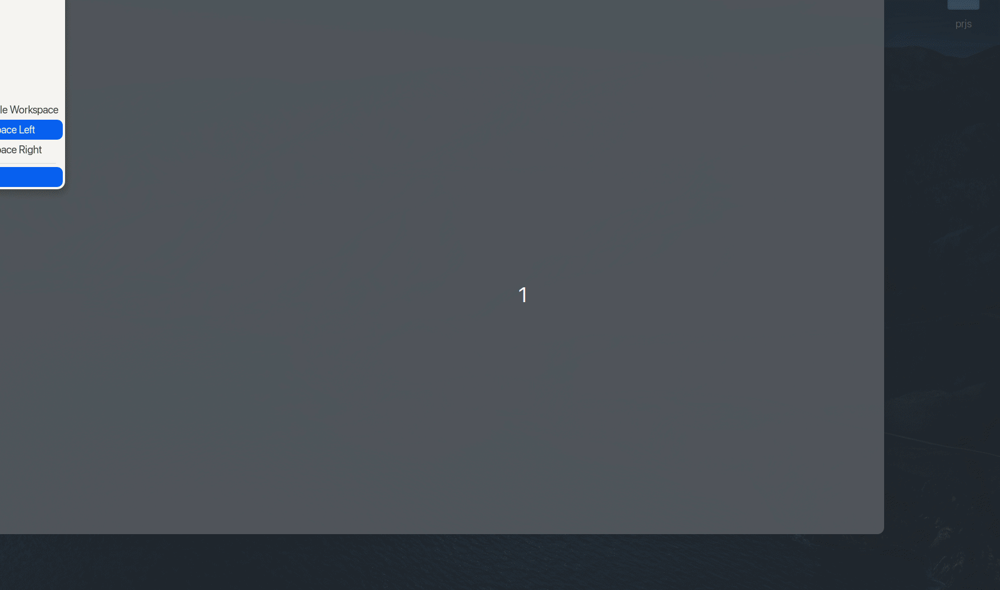

https://github.com/user-attachments/assets/4c39ea0c-1c9d-497e-984c-121559a44c91

# nvcustom - Neovim Configuration Based on NvChad 🎨

[中文版](./README_zh.md)

This is my Neovim configuration on [dotfile](https://dotfyle.com/HugoPhi/nvim), primarily focused on aesthetics and power, so there may be some performance issues. Please bear with me.

## 🛠️ Installation Steps

### 1. Clone and Install the Project, and Choose the Theme Branch 🎨

During installation, you can choose different themes according to your preferences. The project supports three theme branches: `main` (default theme), `light` (light theme), and `dark` (dark theme). The dark theme is suitable for 23-inch displays, while the light theme is mainly for smaller laptop screens. You can choose and clone different branches using the following commands:

- **Default Theme (main)**:

  ```bash
  git clone -b main https://github.com/hugophi/nvcustom.git ~/.config/nvim
  ```

- **Light Theme (light)**:

  ```bash
  git clone -b light https://github.com/hugophi/nvcustom.git ~/.config/nvim
  ```



- **Dark Theme (dark)**:

  ```bash
  git clone -b dark https://github.com/hugophi/nvcustom.git ~/.config/nvim
  ```

https://github.com/user-attachments/assets/4c39ea0c-1c9d-497e-984c-121559a44c91

After cloning, launch Neovim to load the corresponding theme configuration. It may take a little longer the first time.

## 🔧 Core Features Configuration

### 1. `auto-mason.lua` 🚀

Automatically manages the installation and updating of Mason plugins and language servers. Here are the language services that are automatically loaded:

| lsp/formatter Name           | Type            | Supported Languages/Formats     |
| ---------------------------- | --------------- | ------------------------------- |
| `lua-language-server`        | lsp             | lua                             |
| `stylua`                     | formatter       | lua                             |
| `bash-language-server`       | lsp             | bash                            |
| `vtsls`                      | lsp             | typescript, javascript          |
| `html-lsp`                   | lsp             | html                            |
| `css-lsp`                    | lsp             | css                             |
| `prettier`                   | formatter       | html, css, json, yaml, markdown |
| `python-lsp-server`          | lsp & formatter | python                          |
| `basedpyright`               | lsp             | python                          |
| `clangd`                     | lsp             | c/c++                           |
| `awk-language-server`        | lsp             | awk                             |
| `dockerfile-language-server` | lsp             | dockerfile                      |
| `typst-lsp`                  | lsp             | typst                           |
| `gopls`                      | lsp             | go                              |
| `julia-lsp`                  | lsp             | julia                           |

### 2. `bannar.lua` 🎉 (Deprecated, Replaced by alpha.nvim)

Configures the welcome banner for Neovim startup, providing a simple and personalized welcome experience.

### 3. `conform.lua` ⚙️

With the `conform` configuration, nvcustom offers code formatting and style checking features, supporting formatting tools for multiple languages. This includes support for lua, rust, python, c/c++, and others.

### 4. `dashconfigs.lua` 🖥️

Configures the Neovim plugin dashboard and interface settings, ensuring quick access to commonly used functions. The plugin used here is "alpha-nvim," where I have separated the header into this file, and the button and footer are in the plugin folder.

### 5. `lazy.lua` ⏳

Implements lazy loading to optimize Neovim's startup speed by loading plugins on-demand, improving overall performance.

### 6. `lspconfig.lua` 💻

Integrates LSP (Language Server Protocol) to provide intelligent completion, navigation, error highlighting, and other features. It supports multiple programming languages.

### 7. `nvtree.lua` 🌲

Configures Neovim's file tree plugin `nvim-tree`, providing a clean and efficient file browsing experience. You can customize the file icons to match your aesthetic preferences.

### 8. `alpha.nvim`

Configures the welcome interface. The light and dark themes are different, and you can modify the configuration in `plugins/init.nvim`.

## ⚙️ Configuration Files

### 1. `chadrc.lua` 🎨

This is the main configuration file for NvChad, responsible for theme and UI configurations. By modifying this file, you can customize the appearance and theme settings of Neovim to meet your personal needs.

### 2. `mappings.lua` ⌨️

This file is used to set Neovim's key mappings. You can modify or add custom key bindings based on your preferences to improve editing efficiency.

### 3. `options.lua` ⚙️

This file contains global configuration options such as editor behavior, UI settings, and performance optimizations. You can adjust these global options as needed.

## 🚀 Usage

1. After installing and configuring nvcustom, simply launch Neovim to start using it.
2. All core features are enabled by default and optimized according to best practices.

## ✨ Customization

- To customize features or change settings, refer to the [NvChad documentation](https://nvchad.com/) and the documentation of the related plugins.
- Each feature module is configured independently, so you can adjust the configuration files in the `config` directory according to your needs.

## 🤝 Contributing

Contributions are welcome in any form. If you have suggestions or issues, please submit them via GitHub issues or pull requests.

## 📜 License

MIT License.

---

Let me know if you need further adjustments!
