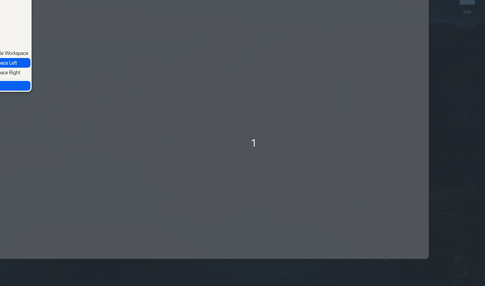

# nvcustom - neovim configuration based on nvchad 🎨

On dotfile: 

[english doc](./readme.md)

这是我的neovim配置，以美观和强大为主要目标，因此可能会有一些性能上的问题大家见谅。

## 🛠️ 安装步骤

### 1. 克隆并安装项目并选择主题分支 🎨

在安装时，你可以根据自己的喜好选择不同的主题。项目支持三个主题分支：`main`（默认主题）、`light`（亮色主题）、`dark`（暗色主题）。其中暗色主题适用于23寸显示屏而亮色主题主要适用于屏幕较小的笔记本电脑等。可以通过以下命令选择并克隆不同的分支：

- **默认主题 (main)**：

  ```bash
  git clone -b main https://github.com/hugophi/nvcustom.git ~/.config/nvim
  ```


- **亮色主题 (light)**：
  ```bash
  git clone -b light https://github.com/hugophi/nvcustom.git ~/.config/nvim
  ```



- **暗色主题 (dark)**：

  ```bash
  git clone -b dark https://github.com/hugophi/nvcustom.git ~/.config/nvim
  ```


完成后，启动 neovim 即可加载对应主题的配置，时间可能会稍微长一些。

## 🔧 核心功能配置

### 1. `auto-mason.lua` 🚀

自动管理 mason插件和语言服务器的安装和更新。这里被自动加载的语言服务有：下面是你提供的 lsp 和 formatter 的清单，按照表格格式整理：

| lsp/formatter 名称           | 类型            | 支持的语言或格式                |
| ---------------------------- | --------------- | ------------------------------- |
| `lua-language-server`        | lsp             | lua                             |
| `stylua`                     | formatter       | lua                             |
| `bash-language-server`       | lsp             | bash                            |
| `vtsls`                      | lsp             | typescript, javascript          |
| `html-lsp`                   | lsp             | html                            |
| `css-lsp`                    | lsp             | css                             |
| `prettier`                   | formatter       | html, css, json, yaml, markdown |
| `python-lsp-server`          | lsp & formatter | python                          |
| `basedpyright`               | lsp             | python                          |
| `clangd`                     | lsp             | c/c++                           |
| `awk-language-server`        | lsp             | awk                             |
| `dockerfile-language-server` | lsp             | dockerfile                      |
| `typst-lsp`                  | lsp             | typst                           |
| `gopls`                      | lsp             | go                              |
| `julia-lsp`                  | lsp             | julia                           |

### 2. `bannar.lua` 🎉 (弃用，被alpha.nvim取代)

配置 neovim 启动时的欢迎横幅，提供一个简洁而富有个性的欢迎体验。

### 3. `conform.lua` ⚙️

通过 `conform` 配置，nvcustom 提供了代码格式化和代码风格检查的功能，支持多种语言的格式化工具。这里配置了对于lua，rust，python，c/c++等语言的支持。

### 4. `dashconfigs.lua` 🖥️

配置 neovim 的插件仪表盘和界面设置，确保你可以快速访问和管理常用功能。这里的插件使用的是"alpha-nvim"，我把header单独拿出来放在这里，button和footer放在plugin文件夹里。

### 5. `lazy.lua` ⏳

实现懒加载机制，优化 neovim 启动速度，并按需加载插件，提升整体性能。

### 6. `lspconfig.lua` 💻

集成 lsp (语言服务器协议)，为你提供智能补全、跳转、错误提示等功能，支持多种编程语言。

### 7. `nvtree.lua` 🌲

配置了 neovim 的文件树插件 `nvim-tree`，提供简洁高效的文件浏览体验。你可以根据文件修改图标以符合你自己的审美风格。

### 8. `alpha.nvim`

关于欢迎界面的配置。亮色和暗色主题不一样，可以在plugins/init.nvim里面修改配置。

## ⚙️ 配置文件介绍

### 1. `chadrc.lua` 🎨

这是 nvchad 的主配置文件，负责主题和 ui 配置。通过修改该文件，你可以自定义 neovim 的外观和主题设置，满足个人化需求。

### 2. `mappings.lua` ⌨️

此文件用于设置 neovim 的键位映射。你可以根据个人习惯，修改和增加快捷键映射，提升编辑效率。

### 3. `options.lua` ⚙️

该文件包含一些全局选项的配置，例如编辑器的行为、界面设置、性能优化等。你可以根据自己的需要调整这些全局选项。

## 🚀 使用方式

1. 安装并配置好 nvcustom 后，直接启动 neovim 即可开始使用。
2. 所有核心功能已默认开启，并且根据最佳实践进行优化。

## ✨ 定制化

- 若要定制功能或修改设置，可以参考 [nvchad 文档](https://nvchad.com/) 以及相关插件的文档。
- 每个功能模块都独立配置，你可以根据自己的需求调整 `config` 目录下的配置文件。

## 🤝 贡献

欢迎任何形式的贡献，若有建议或问题，请通过 github 提交 issue 或 pull request。

## 📜 license

mit license.
